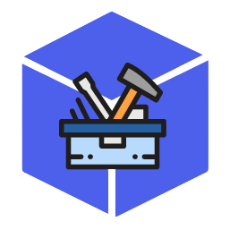

<div align="center">
  <br />
  <p>
    
  </p>
  <br />
  
  <p></p>
</div>

# About


Imagine a handler, that takes your Discord.JS Bot to the next level. [nocli-handler.js](https://github.com/tribui141108/nocli-handler.js) is a next generation powerful Command Handler built for future Discord Bots running [Discord.JS](https://discord.js.org) with [MongoDB](https://mongodb.com) Support. It works just like a normal Discord.JS handler, but with plugins you can install and add to boost your Discord Bot. This package is under development, so expect a stable version at version 1.1.0.

# Installation
```bash
# Using Yarn
yarn add nocli-handler.js

# Using NPM
npm install nocli-handler.js
```

# Setup
### JavaScript
```js
const { Client, Intents } = require('discord.js');
const path = require('path');
const NoCliHandler = require('nocli-handler.js').default;

const client = new Client({
    intents: [
        Intents.FLAGS.GUILDS,
        Intents.FLAGS.GUILD_MESSAGES,
        Intents.FLAGS.GUILD_MESSAGE_REACTIONS,
    ]
});

const instance = new NoCliHandler({
    client,                                    // The Discord.JS Client you initialized
    mongoDB: {
        uri: '',                               // The MongoDB connection string
        options: {}                            // The MongoDB options (optional)
    },
    configuration: {
        defaultPrefix: "",                     // Sets the default prefix (default = "!")
        commandsDir: path.join(__dirname, ''), // Sets the directory where the commands are located
        featuresDir: path.join(__dirname, ''), // Sets the directory where the features are located (will be implemented in the next version)
    },
    debugging: {
        showFullErrorLog: false,               // Whether or not to show the full error log (default = false)
        showBanner: true,                      // Whether or not to show the banner upon the start of the program (default = true)
    },
    language: "JavaScript",                    // The language you are using to develop your Discord.JS Bot
});

client.login('<bot_token>');
```

### TypeScript
```ts
import { Client, Intents } from 'discord.js';
import path from 'path';
import NoCliHandler from 'nocli-handler.js';

const client = new Client({
    intents: [
        Intents.FLAGS.GUILDS,
        Intents.FLAGS.GUILD_MESSAGES,
        Intents.FLAGS.GUILD_MESSAGE_REACTIONS,
    ]
});

const instance = new NoCliHandler({
    client,                                    // The Discord.JS Client you initialized
    mongoDB: {
        uri: '',                               // The MongoDB connection string
        options: {}                            // The MongoDB options (optional)
    },
    configuration: {
        defaultPrefix: "",                     // Sets the default prefix (default = "!")
        commandsDir: path.join(__dirname, ''), // Sets the directory where the commands are located
        featuresDir: path.join(__dirname, ''), // Sets the directory where the features are located (will be implemented in the next version)
    },
    debugging: {
        showFullErrorLog: false,               // Whether or not to show the full error log (default = false)
        showBanner: true,                      // Whether or not to show the banner upon the start of the program (default = true)
    },
    language: "TypeScript",                    // The language you are using to develop your Discord.JS Bot
});

client.login('<bot_token>');
```


# Creating a Command
## JavaScript
```js
/**
 * @type {import("nocli-handler.js").ICommand}
 */
const Command = {
    minArgs: 0, // Optional: Default = 0
    maxArgs: -1, // Optional: Default = -1 (Infinity),
    description: "<command_description>",
    callback: ({ client, message, args }) => {}
}

module.exports = Command;
```
## TypeScript
```ts
import { ICommand } from 'nocli-handler.js';

export default {
    minArgs: 0, // Optional: Default = 0
    maxArgs: -1, // Optional: Default = -1 (Infinity),
    description: "<command_description>",
    callback: ({ client, message, args }) => {}
} as ICommand;
```
